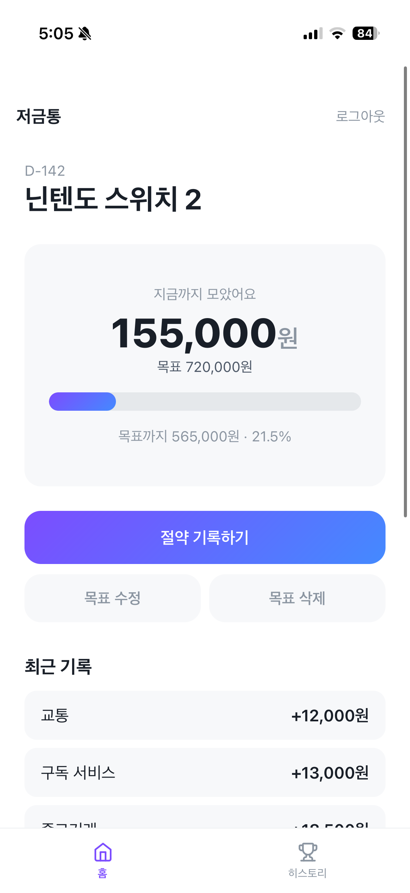
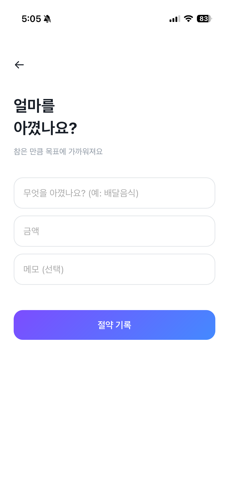
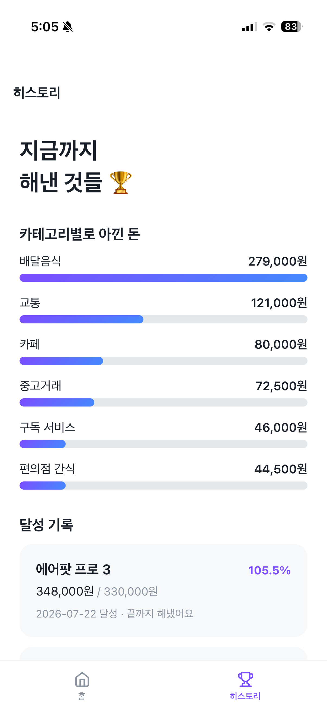

# 모아사 (moasa) 🐷

> **모아서 사는 재미** — 참은 소비를 저축으로 바꾸는, 단기 목표용 절약 앱


먼 미래를 위한 막연한 저축이 아니라, **지금 갖고 싶은 것**(에어팟·닌텐도·러닝화)을 목표로 정하고 평소 무심코 쓰던 돈을 조금씩 아껴 그 금액을 적립하는 앱입니다. 목표가 가깝고 구체적이라, 아끼는 행동이 곧바로 "갖고 싶던 것에 다가가는" 보상으로 이어집니다.

---

## 🔗 데모

- **라이브**: https://moasa.onrender.com
- **데모 계정**: `demo@moasa.app` / `demo1234`

> ⚠️ Render 무료 티어라 첫 접속 시 서버가 깨어나는 데 **30초~1분** 걸릴 수 있습니다(콜드 스타트). 데이터는 Supabase PostgreSQL에 영구 보존됩니다.

### 화면

| 홈 (저금통) | 절약 기록 | 히스토리 · 통계 |
|:---:|:---:|:---:|
|  |  |  |

> 스크린샷은 `docs/screenshots/`에 넣고 위 경로를 맞춰주세요.

---

## 💡 기획 배경

YOLO·플렉스로 대표되는 요즘 소비 환경에서 "노후 대비" 같은 막연하고 먼 저축은 동기를 유지하기 어렵습니다. 모아사는 저축의 목표를 **당장 갖고 싶은 구체적인 물건**으로 좁히고, 그것을 위해 참은 소비를 가상으로 적립하게 합니다.

목표가 손에 잡히는 거리에 있으므로 절약이 "막연한 절제"가 아니라 "**단기적·구체적 보상**을 향한 한 걸음"이 됩니다. 실제 계좌로 돈을 옮기는 부담 없이, 소비 습관을 돌아보고 목표 달성의 성취감을 얻는 것 — 즉 **저축을 지속 가능하게 만드는 동기 설계**가 이 앱의 핵심입니다.

---

## ✨ 주요 기능

- **회원가입 / 로그인** — bcrypt 해시 저장 + JWT 발급, 진입 가드로 미인증 접근 차단
- **목표 관리** — 생성 · 수정(부분 수정) · 삭제, "한 번에 하나" 정책
- **절약 기록** — 카테고리 · 금액 · 메모, 기록 즉시 저금통이 차오름
- **자동 달성 처리 + 축하** — 목표 도달을 서버가 판정, 프론트가 축하 모달 표시
- **달성 히스토리** — 완료한 목표가 훈장처럼 쌓임 (초과 달성은 `107%`처럼 그대로 기록)
- **카테고리별 통계** — `GROUP BY` 집계를 막대 그래프로 ("뭘 제일 많이 참았나")
- **PWA** — 홈 화면에 설치하면 앱처럼 전체화면 실행

---

## 🧰 기술 스택

| 구분 | 기술 | 역할 |
|------|------|------|
| Backend | Python 3.12, FastAPI, Uvicorn | API 서버 (라우터 분리, Pydantic 검증, Depends) |
| DB | PostgreSQL (Supabase), psycopg | 관계형 DB, 컨텍스트 매니저로 연결 관리 |
| Auth | python-jose(JWT/HS256), passlib(bcrypt) | 무상태 인증, 비밀번호 해시 |
| Config | python-dotenv | 비밀 값(.env) 분리 |
| Frontend | HTML / CSS / JavaScript (vanilla) | 프레임워크 없이 구현, 모바일 우선(max-width 480px) |
| PWA | manifest.json + Service Worker | 설치형 웹앱, 오프라인 셸 |
| Infra | Git/GitHub, Render, Supabase | push → 자동 재배포 (CI/CD 기본형) |

**한 줄 요약**
```
Backend  Python · FastAPI · PostgreSQL · JWT(python-jose) · bcrypt(passlib)
Frontend HTML/CSS/JS(vanilla) · 모바일 우선 반응형 · PWA
Infra    Git/GitHub · Render 배포 · Supabase
특징     JWT 무상태 인증 · IDOR 방어 · 입력 검증 이중화 · 트랜잭션 정합성 · RESTful 설계
```

---

## 🗂 시스템 구성

```
moasa/
├── main.py          # 라우터 등록, StaticFiles, 루트 → 로그인 리다이렉트
├── database.py      # get_db() 컨텍스트 매니저, init_db(), KST
├── auth.py          # /signup, /login, get_current_user
├── goals.py         # /goals CRUD + 히스토리 + {goal_id}/savings
├── savings.py       # /savings CRUD + /savings/stats (GROUP BY)
├── seed_demo.py     # 데모 계정 시드 스크립트
└── static/          # 프론트 (vanilla) + PWA 리소스
    ├── style.css    # 디자인 시스템 (CSS 변수 · 공용 클래스)
    ├── index.html · history.html · login.html · signup.html
    ├── add-goal.html · add-saving.html · edit-goal.html
    └── manifest.json · sw.js · 아이콘들
```

### API 개요

```
[인증]  POST /signup · POST /login · GET /me
[목표]  POST /goals · GET /goals/current · PATCH /goals/current
        DELETE /goals/current · DELETE /goals/{id} · GET /goals/history
        GET /goals/{id}/savings
[기록]  POST /savings · GET /savings · DELETE /savings/{id} · GET /savings/stats
```
프론트는 DB 구조를 전혀 모르고 **API 응답 계약만** 알면 되도록 설계했습니다(백/프론트 분리).

---

## 🧠 핵심 설계 판단

> 이 프로젝트에서 가장 공들인 부분입니다. "왜 이렇게 만들었나"를 모두 설명할 수 있게 했습니다.

**목표는 한 번에 하나 — `is_completed` 컬럼 하나로 두 기능 해결**
컬럼 하나가 "진행 중 목표 존재 시 생성 거부" 정책과 "완료된 것만 조회하는 히스토리"를 동시에 담당합니다. 상태를 컬럼으로 코드화한 사례입니다.

**HTTP 상태 코드를 의미로 구분한다**
에러를 뭉뚱그리지 않고 원인별로 코드를 나눴습니다 — 형식 오류는 `400`, 인증 실패는 `401`, 소유권·존재 문제는 `404`, 상태 충돌은 `409`입니다. 특히 중복 이메일이나 이미 진행 중인 목표는 요청 자체는 올바르나 서버의 현재 상태와 충돌하는 것이므로 `400`이 아닌 `409`로 구분했습니다. 프론트가 상태 코드만 보고 분기할 수 있게 하는 계약입니다.

**초과 달성은 이월하지 않는다**
이 앱의 금액은 계좌 잔고가 아니라 "목표를 향한 노력의 기록"입니다. 초과분은 사라지는 게 아니라 히스토리에 `107% 달성`으로 남는 훈장입니다. `progress`는 100으로 자르지 않고 실제 값을 표시하며, 100 제한은 진행률 바 **그래픽에만** 적용합니다 — *데이터는 백엔드, 표현은 프론트*.

**파생 값은 저장하지 않고 매번 계산한다**
`progress`, `d_day`는 DB에 저장하지 않고 조회할 때마다 계산합니다. 저장하면 원본(금액·마감일)과 어긋날 위험이 생기고, 계산 비용은 사실상 0이기 때문입니다.

**응답의 키 이름은 DB가 아니라 백엔드가 정하는 계약**
`{"history": [...]}` 같은 응답 키는 테이블명이 아니라 백엔드가 정한 이름이며, 프론트는 그 형태만 알면 됩니다. 실제로 한 응답의 키가 우연히 테이블명과 같아 혼동한 적이 있었고, 이를 계기로 "프론트는 DB 구조를 전혀 모른다"는 분리를 원칙으로 굳혔습니다.

**목표 금액 수정은 허용하되 "이미 모은 금액 이하"는 금지**
목표 중심 앱에서 목표 금액을 못 고치는 건 치명적 결함입니다. 다만 현재 금액보다 낮게 설정하면 "설정 즉시 달성"이라는 애매한 상태와 재판정 로직이 필요해지므로, **예외를 막아 복잡성을 제거**했습니다.

**삭제는 캐스케이드, 기록은 삭제만(수정 없음)**
목표 삭제 = "이 도전을 없던 걸로" → 딸린 절약 기록도 함께 삭제합니다. "목표만 바꾸고 기록 유지"는 이미 수정(PATCH)이 해결하므로 삭제의 의미가 명확해집니다. 기록은 작고 단순한 데이터라 지우고 다시 쓰는 비용이 0에 가까워, 모든 자원에 CRUD 풀세트를 붙이는 대신 **자원 성격에 맞게** 결정했습니다.

**마감 초과도 실패가 아니라 연장 제안**
사용자를 압박하면 이탈합니다. 마감이 지나면 스케줄러 없이 `d_day < 0`을 프론트가 보고 연장을 제안합니다(게으른 판정). 마감 연장은 별도 기능이 아니라 이미 만든 목표 수정(PATCH)으로 해결됩니다.

---

## 🛠 기술적 도전 & 해결

**"유령 계정" 디버깅 — 코드가 아니라 데이터가 범인**
빈 값으로 로그인해도 통과되는 버그가 있었습니다. 프론트·백엔드 코드를 아무리 봐도 원인이 없었는데, 진짜 범인은 개발 초기 `/docs`로 API를 테스트하다 만들어진 `email=""` 계정이었습니다. 빈 입력 로그인이 그 계정과 "정상적으로" 일치했던 것입니다. 여기서 두 가지를 배웠습니다 — **① 프론트 버그처럼 보여도 원인은 데이터에 있을 수 있다, ② 네트워크 탭에 요청이 "없는 것"도 정보다**(일어났어야 할 일이 안 일어난 것을 찾기). 재발 방지로 백엔드에 빈 값 검증을 추가했습니다.

**SQLite → PostgreSQL 전환 (`database is locked`)**
로컬에선 멀쩡하던 앱이 배포 후 쓰기 충돌을 냈습니다. SQLite는 쓰기 시 파일 전체를 잠그는데, 배포 환경의 동시 요청이 겹치며 드러난 것입니다(로컬은 순차 요청이라 안 겪음). 게다가 Render 무료 티어는 재시작 시 파일시스템이 초기화됩니다. → **Supabase PostgreSQL로 전환**하고, 연결은 `with get_db()` **컨텍스트 매니저**로 감쌌습니다. 수동 `close()`는 예외 발생 시 실행되지 않아 잠금이 남는 반면, `try/finally` 기반 `with`는 어떤 경로에서도 정리를 보장합니다.

**서버 시간대 UTC → KST**
Render 서버는 UTC라 `datetime.now()`가 한국보다 9시간 느렸습니다(로컬은 한국시간이라 안 보임). `KST = timezone(timedelta(hours=9))`를 정의해 저장·비교에 적용했습니다. 단, **JWT 만료(`exp`)는 UTC를 유지** — 만료는 절대 시점이라 UTC가 표준입니다. naive/aware datetime 직접 비교 시 `TypeError`가 나므로 `.date()`로 양쪽을 정규화해 통일했습니다.

**중복 제출 방어**
버튼 연타 시 기록이 여러 개 저장됐습니다. SQLite의 lock이 "우연히" 막아주던 걸 PostgreSQL이 정상 처리하며 드러난, 원래부터 있던 프론트 문제였습니다. 쓰기 함수에 **잠금 깃발 + `try/finally`** 를 적용했습니다. 완전한 방어는 백엔드 멱등성(idempotency)이지만 현 규모에선 프론트로 충분하다고 판단하고 향후 과제로 남겼습니다.

**"코드는 맞는데 동작이 다르다" — 브라우저 캐시**
수정이 반영되지 않는 현상의 원인이, 브라우저가 옛 버전 파일을 캐시에서 제공하던 것이었습니다. "실행 중인 코드가 내가 보는 코드와 다를 수 있다"는 전제로 강력 새로고침·캐시 비활성화를 개발 루틴에 넣었습니다.

---

## 🔐 보안

- **JWT 무상태 인증** — 서버는 `SECRET_KEY` 하나만 보유하고 토큰을 저장하지 않습니다. 검증은 대조가 아니라 **서명 재계산**이라 유저가 아무리 많아도 DB 조회 없이 인증됩니다. 페이로드는 암호화가 아닌 인코딩이므로("읽기 가능, 위조 불가") 민감 정보는 담지 않습니다.
- **비밀번호 해시 (bcrypt + salt)** — 원문은 어디에도 저장하지 않습니다. 사용자마다 다른 솔트로 레인보우 테이블 공격을 무력화하고, 의도적으로 느린 해시로 무차별 대입을 비현실적으로 만듭니다.
- **IDOR 방어** — `id`로 접근하는 모든 API에 소유권 검사(`WHERE id = %s AND user_id = %s`)를 넣고, 실패 시 **403이 아닌 404**를 반환합니다. 403은 "존재는 한다"는 정보를 흘리기 때문입니다. *"id 은닉은 보안이 아니다 — 접근 제어는 검사가 한다."*
- **SQL 인젝션 방어** — 사용자 입력을 문자열로 결합하지 않고 항상 `%s` 파라미터 바인딩을 사용합니다.
- **트랜잭션 정합성** — 절약 기록 한 건은 기록 INSERT + 목표 금액 UPDATE + (도달 시)달성 처리 UPDATE라는 여러 쓰기를 동반합니다. 이를 하나의 커밋으로 묶어, 중간에 실패하면 전부 롤백되도록 했습니다 — 기록만 저장되고 금액은 안 오르는 어긋남을 방지합니다.
- **입력 검증 이중화** — 프론트(입력 편의)와 백엔드(데이터 무결성)를 분리했습니다. 프론트 검증은 우회 가능하므로 백엔드 검증이 필수이며, 형식(파싱) 검증과 비즈니스 규칙(과거 마감일·0 이하 금액) 검증을 나눠 `500`을 `400`으로 바꿨습니다.
- **정보 노출 최소화** — 로그인 실패는 "이메일 또는 비밀번호가 틀렸습니다"로 뭉뚱그려 가입된 이메일이 드러나지 않게 했습니다. `SECRET_KEY`·`DATABASE_URL`은 `.env`(gitignore) / 배포 대시보드 환경변수로 분리했습니다.

---

## ⚙️ 로컬 실행

```bash
# 1. 클론 & 가상환경
git clone https://github.com/SunJong2/Saving_for_Spending.git && cd moasa
python3 -m venv venv && source venv/bin/activate

# 2. 의존성
pip install -r requirements.txt

# 3. 환경변수 (.env 생성)
#   SECRET_KEY=... (python -c "import secrets; print(secrets.token_hex(32))")
#   DATABASE_URL=postgresql://유저:비밀번호@호스트:포트/db

# 4. (선택) 데모 데이터 심기
python seed_demo.py

# 5. 실행
uvicorn main:app --reload
#   → http://localhost:8000/static/login.html
```

---

## 📚 개발 기록

기획부터 배포까지 설계·구현 과정을 주차별로 정리했습니다.

- [1주차 — 기획 · DB 설계 · 세팅](docs/moasa_summary/week1_summary.md)
- [2주차 — 인증 (bcrypt · JWT)](docs/moasa_summary/week2_summary.md)
- [3주차 — 핵심 CRUD](docs/moasa_summary/week3_summary.md)
- [4주차 — 달성 처리 · 수정/삭제 · 입력 검증](docs/moasa_summary/week4_summary.md)
- [5주차 — 보안(IDOR) · 프론트 시작](docs/moasa_summary/week5_summary.md)
- [6주차 — 프론트 MVP 완성](docs/moasa_summary/week6_summary.md)
- [7주차 — 배포 · PostgreSQL 전환 · 폰 UI](docs/moasa_summary/week7_summary.md)
- [8주차 — 디자인 시스템 · 통계 · PWA · 데모](docs/moasa_summary/week8_summary.md)

---

## 🚀 향후 계획

- **퀵 버튼** — 자주 쓰는 절약 항목 원터치 등록
- **Streak** — 연속 절약 일수 (동기 부여)
- **환산 표시** — "치킨 N마리 참음" 같은 직관적 환산
- **비밀번호 재설정** — 이메일 인증 인프라 기반 (해시는 복원 불가 → 실체는 재설정)
- **멱등성 키** — 중복 제출의 완전한 백엔드 방어
- **소셜 로그인 · 그룹 챌린지** — 함께 아끼는 재미

---

<p align="center">모아서 사는 재미, 모아사 🐷</p>
